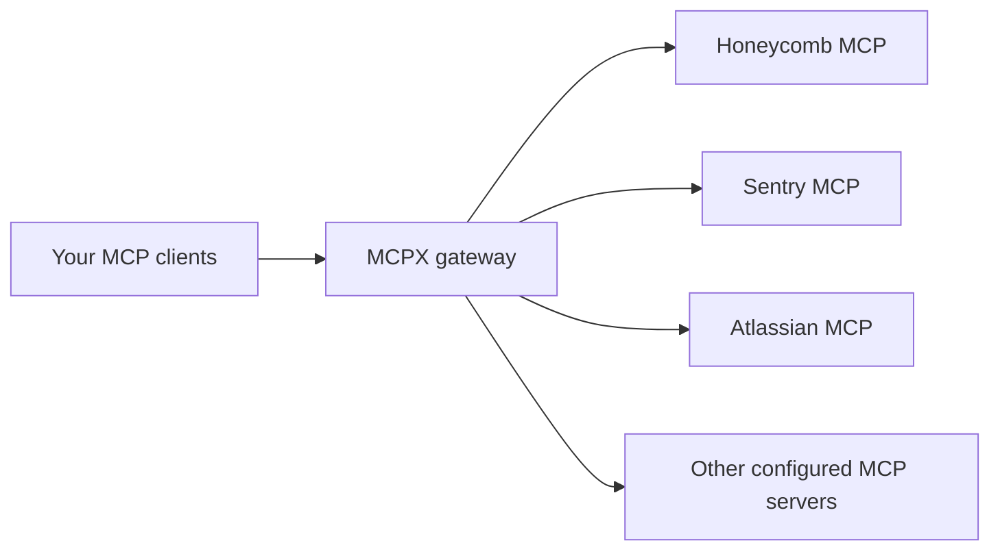

<div align="center">
  
  
</div>

# Lunar MCPX · jfet97's fork

**One connection to your MCP services, with tools discovered as you need them.**

MCPX combines multiple MCP servers behind a single gateway. Clients such as Claude Code and Codex can use services such as Honeycomb, Sentry, and Atlassian through that connection. You choose which servers to configure; MCPX manages their connections, authentication, and tool access.

This fork of [TheLunarCompany/lunar](https://github.com/TheLunarCompany/lunar) focuses on local MCPX use: complete tool discovery, local semantic search, saved configurations, and backups you can export yourself. The repository also contains the original Lunar Proxy for managing outbound API traffic.

[Connect a client](#connect-a-client) · [Discover tools](#discover-tools-without-loading-the-whole-catalog) · [Server access and authentication](#manage-server-access-and-authentication) · [Saved setups and backups](#saved-setups-and-backups) · [Run the fork](#run-the-fork) · [Repository guide](#repository-guide)



## What this fork adds

| Addition | What it does for you |
| --- | --- |
| Complete upstream catalogs | Follows every page of an upstream server's tool list, so tools beyond the first page are available. |
| On-demand tool discovery | Gives the client four gateway tools for finding services, searching tools, inspecting schemas, and calling a chosen tool. |
| Local semantic search | Finds tools by meaning as well as keywords, using a bundled multilingual model on CPU. No external inference service is required; keyword search remains available if the model cannot run. |
| Immediate access control and OAuth logout | Enforces the existing activation toggle for connected clients and lets you clear a server's saved authentication before signing in again. |
| Local saved setups | Lets a standalone gateway save named configurations and restore them from the UI. |
| Gateway backup export | Exports configuration and durable authentication state, available deployment and client files, and explicitly selected companion files, with a manual recovery guide. |
| Published fork images | Builds Linux ARM64 images from the fork, with commit tags and regression checks. |

## Connect a client

Once MCPX is running, point your client at one of these endpoints:

| Endpoint | How the client sees tools |
| --- | --- |
| `http://localhost:9000/mcp/lazy` | Four discovery tools plus permitted built-in management tools. Upstream tools are discovered when needed. |
| `http://localhost:9000/mcp` | The complete catalog of upstream tools visible to that client. |

The examples below use the on-demand endpoint. Replace `localhost:9000` with your gateway address when running it elsewhere.

### Claude Code

Add this entry to your MCP configuration:

```json
{
  "mcpServers": {
    "mcpx": {
      "type": "http",
      "url": "http://localhost:9000/mcp/lazy"
    }
  }
}
```

### Codex

Add this entry to your configuration:

```toml
[mcp_servers.mcpx]
url = "http://localhost:9000/mcp/lazy"
startup_timeout_sec = 60
```

Reconnect after changing the endpoint or upgrading the gateway. An existing session may retain its previous tool catalog and need a session restart.

## Discover tools without loading the whole catalog

The `/mcp/lazy` endpoint advertises four discovery tools and, by default, nine built-in management tools. Its startup instructions ask the client to discover the available servers immediately. Management tools can be called directly; use discovery for upstream tools.

| Step | Tool | Result |
| --- | --- | --- |
| 1. Learn what is connected | `mcpx_list_servers` | Visible server names and their existing descriptions, when available. |
| 2. Find a tool for the task | `mcpx_search_tools` | A short list of matching tools, ranked by semantic and keyword search. |
| 3. Inspect its arguments | `mcpx_get_tool_schema` | The selected tool's full schema. |
| 4. Use it | `mcpx_call_tool` | The upstream tool's result. |

For example, a client can first learn that Honeycomb is available, search for a tracing task, inspect the matching tool, and call it. It only retrieves schemas for the tools it chooses.

Discovery respects the caller's permissions, and execution uses the gateway's existing authentication and authorization path. Server descriptions come from upstream metadata or the MCPX catalog; missing descriptions are omitted. The full `/mcp` endpoint and legacy `/sse` endpoint remain available.

See the [tool discovery guide](mcpx/docs/lazy-tools.md) for search pagination, local embeddings, and execution behavior.

## Manage MCP servers from an MCP client

MCPX registers nine built-in management tools on `/mcp` by default. On
`/mcp/lazy`, permitted management tools are advertised directly alongside the
four discovery tools. Their qualified names use the `mcpx__` prefix, such as
`mcpx__management_list_servers`; call them directly without searching first.

The tools list servers; add, update, enable, disable, and remove server
configurations; create backups; and start OAuth login or clear saved OAuth
authentication. Existing MCPX authentication applies, and each tool uses its
configured `mcpx` tool permission for discovery and execution. These
administrative actions can manage any configured upstream server. Enabling or
disabling preserves its configuration and authentication. OAuth login returns
a sign-in URL and optional device code for the user to complete in a browser.

Setup backups use the existing local or Hub saved-setup owner. Full backups
write to MCPX's configured private backup directory and return metadata and
omissions; they do not return file contents or accept caller-selected paths.
Hub-managed data and unavailable optional sources are omitted and reported.
See the [management tools guide](mcpx/docs/management-tools.md) for details.

## Manage server access and authentication

Use the existing server activation toggle to enable or disable an MCP server.
Disabling immediately blocks new calls for connected clients, including requests
using cached tool names or results. Calls already executing may finish. Re-enabling
restores access without reconnecting the client; disabling preserves saved authentication.

OAuth servers also offer **Logout** in the MCP Servers list and server details
drawer. Logout closes the connection, clears saved OAuth credentials, and returns
the server to **Authentication required**. Choose **Authenticate** to sign in again.
Pending login flows and old callbacks are cancelled, and cached results from the
previous login are not reused. The server configuration is preserved.

Logout clears authentication stored by MCPX; the provider's browser session is
managed separately. See the [server authentication guide](mcpx/docs/server-authentication.md)
for details and the logout API.

## Saved setups and backups

Both actions live on the **Saved Setups** page, but solve different problems:

| Question | Saved setup | Gateway backup |
| --- | --- | --- |
| Use it when… | You want to keep a configuration and switch back to it later. | You want a copy for recovery after losing gateway data or moving an installation. |
| Example | Save your working setup before experimenting with servers or access rules, then restore it from the UI. | Export before moving machines, then import gateway state and recover companion services separately. |
| Server and gateway configuration | Included. | Included. |
| Previously saved setups | Each saved setup stores its own configuration. | Includes locally stored saved setups. |
| OAuth login state | Not included. | Includes durable tokens and registered OAuth client information. |
| Deployment and client configuration | Not included. | Included when the files are available to the gateway. |
| Companion MCP services | Connection settings only. | Connection settings and explicitly selected files; images and service data need separate recovery. |
| How you restore it | Choose **Restore** in the UI. | Preview and queue **Import Gateway Backup**, then restart MCPX; deployment, client, and companion files are recovered manually. |

### Save a setup to switch configurations

A saved setup records the configured MCP servers and gateway settings. Restoring it applies those settings to the running gateway. OAuth authentication state is separate, so a saved setup cannot recover lost login tokens.

For example, suppose MCPX connects to Honeycomb through OAuth and to an
`atlassian-media` Docker service at `http://atlassian-media:9005/mcp`. Save a setup
named **Working configuration** before changing access rules or removing a server.
Restoring it brings back those connection settings and access rules. It does not
recreate the `atlassian-media` container, restore its environment variables, or
recover a lost Honeycomb login.

Literal environment values entered in an MCPX server entry are included. A
reference such as `{ "fromEnv": "API_TOKEN" }` preserves the reference; the value
must still be supplied from its external source. Variables defined only in another
container's Compose or `.env` file are outside that saved setup.

Standalone instances store setups in `.mcpx/saved-setups`, inside MCPX's persistent state. Enterprise instances and instances authenticated to Hub keep using Hub storage. A locally saved setup lives with the gateway's data; losing that data also loses the setup.

### Export a gateway backup for recovery

Choose **Export Gateway Backup** to write a separate directory containing configuration, locally saved setups, durable OAuth state, and any available deployment and client configuration files. The export includes a manifest showing what was included or omitted, an upstream service inventory, and `RESTORE.md` with manual recovery steps. Hub-managed data must be recovered through Hub.

Companion service files can be included through an explicit file selection. Docker installation, images, other services' volumes, and their running environments are not exported. Deployment and client files are reference copies: adapt their paths and networks on another machine. See the guide below for selecting companion Compose, environment, and configuration files.

The default destination is `~/.config/mcpx/backups`. With Docker, mount a host directory and configure the export destination so the files are accessible outside the container. Exports use private file permissions because they can contain credentials.

Backups are created when you choose to export them. To import a gateway backup on a standalone instance, place the exported folder in the destination gateway's backup directory, choose **Import Gateway Backup**, preview it, then queue it and restart MCPX. The import replaces gateway configuration, locally saved setups, and OAuth state before connections open. It retains previous gateway files for manual rollback. Deployment, client, and companion files still require manual recovery. The Saved Setups **Restore** action only applies a saved configuration.

See the [backup and restore guide](mcpx/docs/local-saved-setups-and-export.md) for exact coverage and restore steps, and the [Compose overlay](mcpx/examples/compose.local-export.yaml) for host mounts.

See [Understanding MCPX backups](mcpx/docs/backup-examples.md) for worked examples
covering remote MCPs, local processes, Docker services, literal credentials,
environment references, and recovery when images or services are missing.

## Run the fork

The fork publishes its MCPX image to [GitHub Container Registry](https://github.com/jfet97/lunar/pkgs/container/mcpx):

```text
ghcr.io/jfet97/mcpx:main
ghcr.io/jfet97/mcpx:<full-commit-sha>
```

Published images target **Linux ARM64**, including Docker on Apple Silicon. The moving `main` tag follows successful builds; commit tags identify a source revision. Pin the published digest when you want to keep an installation on a specific image.

For setup instructions and the control-plane UI, start with the [MCPX guide](mcpx/README.md). Preserve the gateway's configuration and `.mcpx` state in persistent volumes so settings, OAuth state, and local saved setups survive container replacement.

To build the fork yourself, run this from the repository root:

```sh
docker build --target mcpx -f mcpx/Dockerfile .
```

The build includes the shared core under `ai-gateway-shared/public`; the repository root is the required build context.

Changes to MCPX, the shared core, or the publishing workflow on `main` run regression checks and publish an image. Pull requests touching MCPX also check types, changed-file lint, regressions, and the UI build. A push that only changes this root README does not trigger an image build. Publishing an image does not upgrade an existing installation.

## Repository guide

| Location | Purpose |
| --- | --- |
| [MCPX](mcpx/README.md) | MCP server aggregation, connection management, and the control-plane UI. This fork's additions live here. |
| [Lunar Proxy](proxy/README.md) | Outbound API traffic visibility and policies, including rate limits, retries, queues, and circuit breakers. |
| [Shared core](ai-gateway-shared/public/README.md) | Shared infrastructure used by the gateway components. |
| [Tool discovery guide](mcpx/docs/lazy-tools.md) | The four gateway tools, search behavior, and client configuration. |
| [Management tools guide](mcpx/docs/management-tools.md) | Built-in server administration, permissions, OAuth, and backup behavior. |
| [Backup and restore guide](mcpx/docs/local-saved-setups-and-export.md) | Saved setup behavior, export coverage, Docker mounts, and manual recovery. |

Lunar MCPX and Lunar Proxy are developed upstream by [The Lunar Company](https://github.com/TheLunarCompany/lunar). Upstream product documentation is available at [docs.lunar.dev](https://docs.lunar.dev/). Fork-specific behavior is documented in this repository.

This repository is distributed under the [MIT license](LICENSE). See each component's license file for its notices.
